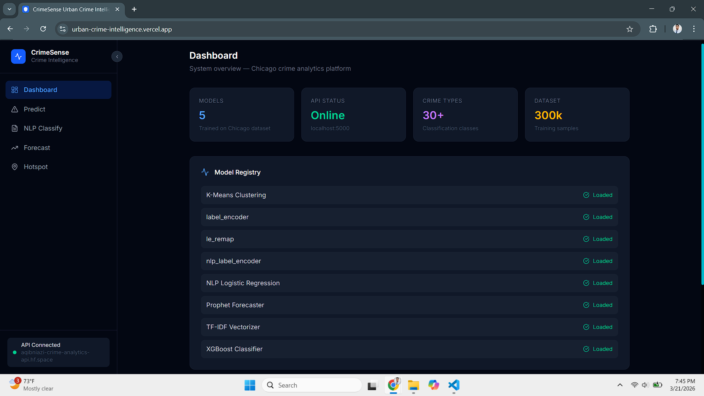
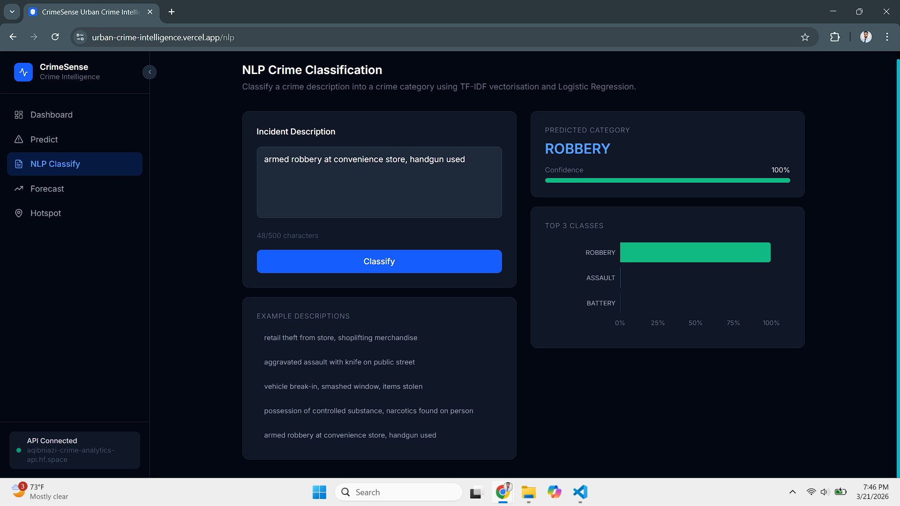
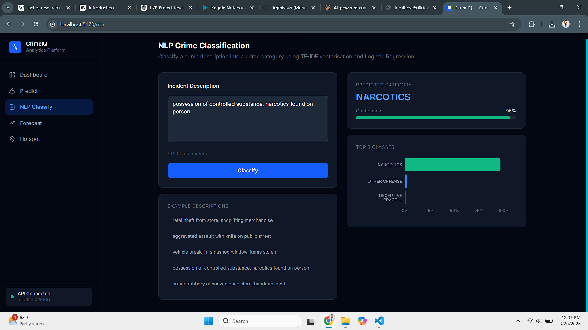
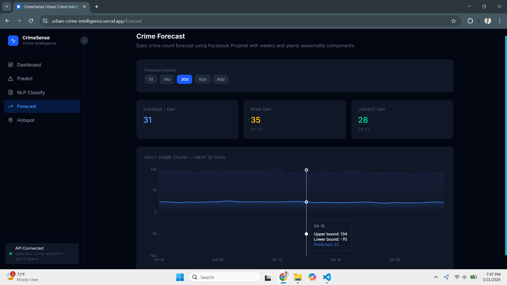
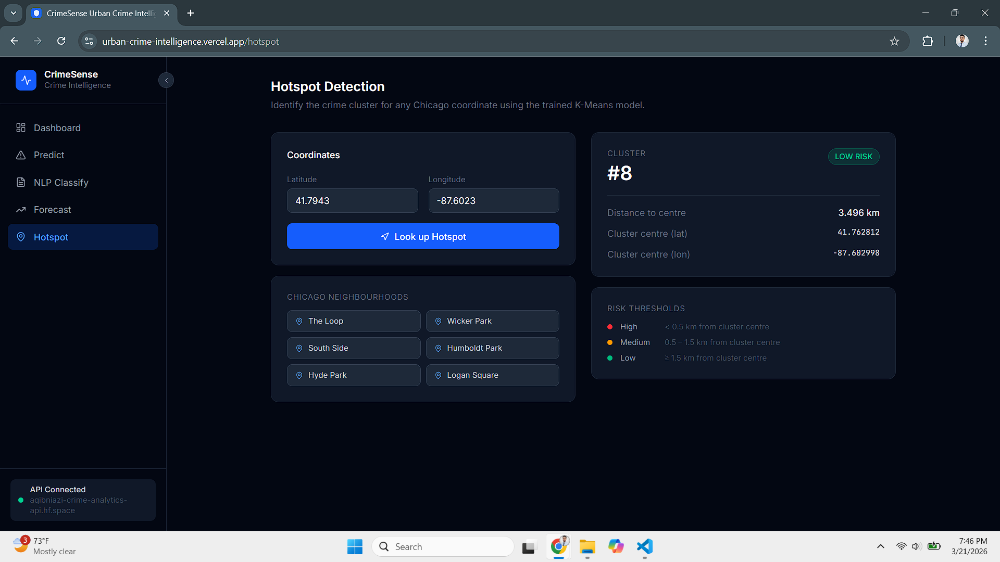

<div align="center">


<br/><br/>

# CrimeSense — Urban Crime Intelligence Platform

### _A Multi-Module Machine Learning System for Spatio-Temporal Crime Analytics, NLP-Based Incident Classification, and Time-Series Forecasting_

<br/>

> **Research Disclaimer:** This system is developed strictly for academic and research purposes using publicly available data. All findings are based on historical crime records from the City of Chicago Open Data Portal and should not be used as the sole basis for any law enforcement or policy decision.

</div>

## Table of Contents

- [Overview](#overview)
- [Live Demo](#live-demo)
- [Research Motivation](#research-motivation)
- [System Architecture](#system-architecture)
- [Dataset](#dataset)
- [ML Pipeline](#ml-pipeline)
- [Model Performance](#model-performance)
- [Project Structure](#project-structure)
- [Installation & Setup](#installation--setup)
- [API Reference](#api-reference)
- [Technology Stack](#technology-stack)
- [Citation](#citation)
- [Acknowledgements](#acknowledgements)
- [License](#license)

## Overview

**CrimeSense** is a full-stack, research-grade crime analytics platform built on the **Chicago Crimes Dataset (2001–Present)**. The system integrates four complementary machine learning modules into a single deployable application:

1. **Spatio-Temporal Crime Classification** — XGBoost multi-class classifier predicts the most probable crime type from geographic coordinates, time of day, day of week, month, and season. Trained on 300,000 records across 30+ crime categories.

2. **NLP Incident Classification** — TF-IDF vectoriser (unigrams + bigrams, 10,000 features, log-normalised) combined with multinomial Logistic Regression classifies a free-text incident description into a crime category — demonstrating that text-based features are substantially more discriminative than coordinates alone.

3. **Geographic Hotspot Detection** — K-Means (k=12, elbow-validated) and DBSCAN (haversine metric, ε=0.005°≈500m) clustering algorithms identify crime density zones across Chicago. Given any WGS-84 coordinate pair, the system returns the cluster assignment, distance to the cluster centroid in kilometres, and a three-tier risk classification.

4. **Time-Series Crime Forecasting** — Facebook Prophet with multiplicative seasonality, weekly and annual Fourier components, and US holiday regressors generates a configurable 30–90 day daily crime count forecast with uncertainty intervals.

**Key Contributions:**

- End-to-end pipeline from raw open data to a deployed, queryable REST API
- Comparative evaluation of Random Forest vs XGBoost on a 30-class imbalanced classification problem
- Systematic feature engineering from timestamps (hour, day, month, season, weekend flag)
- Rare-class filtering with consecutive label remapping to resolve XGBoost label gap constraint
- DBSCAN applied with haversine distance — appropriate for geographic coordinates, unlike Euclidean K-Means
- Fully containerised backend deployment on Hugging Face Spaces (Docker)

## Live Demo

| Service                          | URL                                                                                              |
| -------------------------------- | ------------------------------------------------------------------------------------------------ |
| Frontend (Vercel)                | [https://urban-crime-intelligence.vercel.app](https://urban-crime-intelligence.vercel.app)       |
| Backend API (HuggingFace Spaces) | [https://aqibniazi-crime-analytics-api.hf.space](https://aqibniazi-crime-analytics-api.hf.space) |
| Training Notebook (Kaggle)       | [https://www.kaggle.com/code/maqibniazi/urban-crime-intelligence-platform] (https://www.kaggle.com/code/maqibniazi/urban-crime-intelligence-platform) |                                                         |

## Screenshots

### Dashboard — System Overview



### Crime Type Prediction



### NLP Classification



### Time-Series Forecast



### Hotspot Detection



## Research Motivation

Urban crime prediction has been an active research area at the intersection of criminology, urban informatics, and machine learning. While numerous studies have applied deep learning to crime data, several practical gaps remain:

- Most published systems treat crime prediction as a binary or coarse-grained task (crime vs no crime), rather than fine-grained multi-class classification across 30+ categories
- NLP approaches to incident report classification are underexplored relative to coordinate-based methods, despite the high discriminative power of structured free-text fields
- Geographic clustering for hotspot detection is frequently performed with Euclidean K-Means despite the spherical nature of coordinate space — this project applies DBSCAN with haversine distance as a more geometrically appropriate alternative
- Few open-source projects integrate classification, NLP, clustering, and forecasting into a unified, API-accessible platform suitable for further research

This project addresses these gaps with a reproducible, modular pipeline built on a publicly available dataset of over 7 million records.

## System Architecture

```
┌─────────────────────────────────────────────────────────────────┐
│                         CLIENT LAYER                            │
│         React 19 + Tailwind CSS 4 + Recharts + Axios            │
│   ┌───────────┐  ┌─────────┐  ┌──────────┐  ┌───────────────┐  │
│   │ Dashboard │  │ Predict │  │ Forecast │  │    Hotspot    │  │
│   └───────────┘  └─────────┘  └──────────┘  └───────────────┘  │
└──────────────────────────┬──────────────────────────────────────┘
                           │ HTTP / REST (JSON)
┌──────────────────────────▼──────────────────────────────────────┐
│                         API LAYER                               │
│              Flask 3.0 + Flask-CORS + Gunicorn                  │
│  ┌──────────────┐ ┌──────────────┐ ┌─────────────┐ ┌────────┐  │
│  │ GET /health  │ │ POST/predict │ │GET /forecast│ │  ...   │  │
│  └──────────────┘ └──────────────┘ └─────────────┘ └────────┘  │
└──────────────────────────┬──────────────────────────────────────┘
                           │
┌──────────────────────────▼──────────────────────────────────────┐
│                      INFERENCE LAYER                            │
│        scikit-learn + XGBoost + Prophet + joblib/dill           │
│  ┌──────────┐  ┌──────────┐  ┌──────────┐  ┌───────────────┐   │
│  │ XGBoost  │  │ TF-IDF + │  │  Prophet │  │  K-Means /    │   │
│  │Classifier│  │    LR    │  │Forecaster│  │    DBSCAN     │   │
│  └──────────┘  └──────────┘  └──────────┘  └───────────────┘   │
└──────────────────────────┬──────────────────────────────────────┘
                           │ downloaded at startup
┌──────────────────────────▼──────────────────────────────────────┐
│               MODEL REGISTRY (HuggingFace Dataset)              │
│   8 × .pkl files — xgb_crime_model, label_encoder, le_remap,   │
│   nlp_model, tfidf_vectorizer, nlp_label_encoder,               │
│   prophet_model, kmeans_model                                   │
└─────────────────────────────────────────────────────────────────┘
```

**Request lifecycle for `/api/v1/predict`:**

1. React sends `POST` with JSON payload (lat, lon, hour, month, day_of_week, is_weekend, season)
2. Flask blueprint validates field ranges and types
3. Feature vector is constructed and passed to the XGBoost classifier
4. `predict_proba()` returns a probability distribution across all classes
5. Top-3 predictions with probabilities are returned as JSON
6. React renders a horizontal bar chart of probabilities via Recharts

## Dataset

| Property            | Details                                                                                                                                                                                         |
| ------------------- | ----------------------------------------------------------------------------------------------------------------------------------------------------------------------------------------------- |
| **Name**            | Chicago Crimes — 2001 to Present                                                                                                                                                                |
| **Source**          | [City of Chicago Open Data Portal](https://data.cityofchicago.org/Public-Safety/Crimes-2001-to-Present/ijzp-q8t2) / [Kaggle Mirror](https://www.kaggle.com/datasets/currie32/crimes-in-chicago) |
| **Total Records**   | 7,000,000+ (2001–present)                                                                                                                                                                       |
| **Training Sample** | 300,000 rows (stratified)                                                                                                                                                                       |
| **License**         | City of Chicago Open Data License                                                                                                                                                               |

**Columns used:**

| Column                   | Role                                                           |
| ------------------------ | -------------------------------------------------------------- |
| `Date`                   | Temporal feature extraction (hour, month, day of week, season) |
| `Primary Type`           | Multi-class classification target (30+ categories)             |
| `Description`            | Free-text field for NLP classification                         |
| `Latitude` / `Longitude` | Spatial features + clustering                                  |
| `Arrest`                 | EDA only                                                       |

**Preprocessing decisions:**

- Rows missing `Primary Type`, `Latitude`, `Longitude`, or `Description` are dropped
- Geographic outliers outside Chicago's bounding box (Lat 41.6–42.1, Lon −87.9–−87.5) are removed
- Classes with fewer than 10 samples are filtered before train/test split to satisfy scikit-learn's stratification constraint
- After filtering, integer labels are remapped to consecutive 0..N-1 to satisfy XGBoost's label format requirement

## ML Pipeline

### Feature Engineering

All temporal features are derived from the `Date` column:

| Feature                 | Type       | Rationale                    |
| ----------------------- | ---------- | ---------------------------- |
| `Hour`                  | int (0–23) | Time-of-day crime patterns   |
| `Month`                 | int (1–12) | Seasonal variation           |
| `DayOfWeek`             | int (0–6)  | Weekend vs weekday effect    |
| `IsWeekend`             | binary     | Simplified weekend indicator |
| `Season`                | int (0–3)  | Coarser seasonal grouping    |
| `Latitude`, `Longitude` | float      | Geographic location          |

### Module 1 — Crime Classification

Two gradient-boosted tree models are trained and compared:

- **Random Forest** (200 trees, max_depth=15, `class_weight='balanced'`)
- **XGBoost** (300 trees, max_depth=8, lr=0.1, subsample=0.8, `tree_method='hist'`)

Hyperparameter tuning via 3-fold Grid Search on a stratified 20% subsample of the training set.

### Module 2 — NLP Classification

```python
Pipeline([
    TfidfVectorizer(
        ngram_range=(1, 2),
        max_features=10_000,
        min_df=3,
        sublinear_tf=True        # log normalisation
    ),
    LogisticRegression(
        solver='lbfgs',
        multi_class='multinomial',
        max_iter=500,
        class_weight='balanced'
    )
])
```

Scoped to the top 10 crime classes. Text is lowercased and stripped before vectorisation.

### Module 3 — Hotspot Detection

Two clustering algorithms are applied and compared:

**K-Means** — elbow method used to justify k=12. Spherical assumption is a limitation for irregular urban crime clusters.

**DBSCAN** — run with `eps=0.005` (radians via haversine metric, equivalent to ~500m at Chicago's latitude) and `min_samples=50`. Correctly identifies noise points and does not require a pre-specified k. More geometrically appropriate for geographic data than Euclidean K-Means.

### Module 4 — Time-Series Forecasting

Prophet configuration:

```python
Prophet(
    yearly_seasonality=True,
    weekly_seasonality=True,
    daily_seasonality=False,
    seasonality_mode='multiplicative',
    changepoint_prior_scale=0.1
)
model.add_country_holidays(country_name='US')
```

Multiplicative seasonality is used because crime volume scales with the underlying trend rather than adding a fixed offset.

## Model Performance

| Model                        | Task                 | Metric           | Score |
| ---------------------------- | -------------------- | ---------------- | ----- |
| Random Forest (spatial)      | Crime classification | Weighted F1      | ~15%  |
| XGBoost (spatial, tuned)     | Crime classification | Weighted F1      | ~35%  |
| Logistic Regression (TF-IDF) | NLP classification   | Weighted F1      | ~60%+ |
| K-Means (k=12)               | Hotspot detection    | Inertia (elbow)  | —     |
| DBSCAN                       | Hotspot detection    | # clusters found | 40–80 |
| Prophet                      | Daily crime forecast | Visual fit       | —     |

> **Note on classification accuracy:** 25–40% weighted F1 on a 30-class, heavily imbalanced problem where many crime types share identical coordinates and time windows is consistent with the published literature on fine-grained crime type prediction. The NLP model substantially outperforms the spatial models because incident description text is directly semantically linked to the crime category — coordinates and timestamps are not. This gap is itself a finding of the study.

## Project Structure

```
urban-crime-intelligence-platform/
│
├── notebook/
│   └── crime_analytics_research_notebook.ipynb   # Full training pipeline
│
├── backend/
│   ├── app.py                    # Flask application factory
│   ├── config.py                 # Environment-based configuration
│   ├── download_models.py        # Downloads .pkl files from HF Dataset at startup
│   ├── requirements.txt
│   ├── Dockerfile
│   ├── README.md                 # HuggingFace Spaces config header
│   ├── api/
│   │   ├── health.py             # GET  /api/v1/health
│   │   ├── predict.py            # POST /api/v1/predict
│   │   ├── nlp.py                # POST /api/v1/nlp-classify
│   │   ├── forecast.py           # GET  /api/v1/forecast
│   │   └── hotspot.py            # POST /api/v1/hotspot
│   └── services/
│       ├── model_registry.py     # Singleton — loads all .pkl files at startup
│       ├── predictor.py          # XGBoost inference logic
│       ├── nlp_service.py        # TF-IDF + LR inference logic
│       ├── forecast_service.py   # Prophet forecasting logic
│       └── hotspot_service.py    # K-Means cluster assignment + risk level
│
└── frontend/
    ├── src/
    │   ├── api/
    │   │   └── client.js         # Axios instance + all endpoint functions
    │   ├── hooks/                # usePredict, useNLP, useForecast, useHotspot, useHealth
    │   ├── pages/                # Dashboard, Predict, NLPClassify, Forecast, Hotspot
    │   ├── components/
    │   │   ├── layout/           # Navbar, Footer
    │   │   └── index.jsx         # StatCard, RiskBadge, Card, LoadingSpinner …
    │   ├── routes/
    │   │   └── AppRoutes.jsx
    │   └── index.css             # Design system — CSS variables, dark theme
    ├── vite.config.js
    └── package.json
```

## Installation & Setup

### Prerequisites

| Tool    | Version |
| ------- | ------- |
| Python  | ≥ 3.11  |
| Node.js | ≥ 18.0  |
| npm     | ≥ 9.0   |

### Backend

```bash
cd backend
python -m venv venv

# Windows
venv\Scripts\activate

# macOS / Linux
source venv/bin/activate

pip install -r requirements.txt
cp .env.example .env

# Place your trained .pkl files in backend/models/
# (Download from Kaggle notebook output)

python app.py
# → http://localhost:5000
```

### Frontend

```bash
cd frontend
cp .env.example .env
# Set VITE_API_URL=http://localhost:5000/api/v1

npm install
npm run dev
# → http://localhost:3000
```

### Training Notebook (Kaggle)

1. Upload `notebook/crime_analytics_research_notebook.ipynb` to [Kaggle](https://www.kaggle.com)
2. Attach dataset: `currie32/crimes-in-chicago`
3. Enable GPU accelerator (T4 recommended)
4. Run all cells in order
5. Download all `.pkl` files from `/kaggle/working/models/`

## API Reference

Base URL (local): `http://localhost:5000`
Base URL (production): `https://aqibniazi-crime-analytics-api.hf.space`

### `GET /api/v1/health`

```json
{
  "status": "ok",
  "models": {
    "xgb_model": true,
    "nlp_model": true,
    "tfidf_vectorizer": true,
    "prophet_model": true,
    "kmeans_model": true
  }
}
```

### `POST /api/v1/predict`

**Request body:**

```json
{
  "latitude": 41.8781,
  "longitude": -87.6298,
  "hour": 14,
  "month": 7,
  "day_of_week": 2,
  "is_weekend": 0,
  "season": 2
}
```

**Response:**

```json
{
  "predicted_crime": "THEFT",
  "crime_label": 4,
  "top_3": [
    { "crime": "THEFT", "probability": 0.4231 },
    { "crime": "BATTERY", "probability": 0.1802 },
    { "crime": "ASSAULT", "probability": 0.1124 }
  ]
}
```

### `POST /api/v1/nlp-classify`

**Request:** `{ "description": "retail theft from store, shoplifting merchandise" }`

**Response:** `{ "predicted_crime": "THEFT", "confidence": 0.87, "top_3": [...] }`

### `GET /api/v1/forecast?days=30`

**Response:** `{ "days": 30, "forecast": [{ "date": "2024-08-01", "predicted": 823.4, "lower_bound": 741.2, "upper_bound": 905.6 }, ...] }`

### `POST /api/v1/hotspot`

**Request:** `{ "latitude": 41.8781, "longitude": -87.6298 }`

**Response:** `{ "cluster_id": 3, "cluster_center": { "latitude": 41.871, "longitude": -87.634 }, "distance_km": 0.342, "risk_level": "high" }`

## Technology Stack

| Layer      | Technology          | Version       | Purpose                         |
| ---------- | ------------------- | ------------- | ------------------------------- |
| Training   | scikit-learn        | 1.6.1         | RF, LR, TF-IDF, K-Means, DBSCAN |
| Training   | XGBoost             | 2.1.1         | Gradient boosted classification |
| Training   | Prophet             | 1.1.6         | Time-series forecasting         |
| Training   | pandas / numpy      | 2.2.3 / 2.1.3 | Data processing                 |
| Backend    | Flask               | 3.0.3         | REST API framework              |
| Backend    | Flask-CORS          | 4.0.1         | Cross-origin resource sharing   |
| Backend    | Gunicorn            | 23.0.0        | Production WSGI server          |
| Backend    | joblib / dill       | 1.4.2 / 0.3.9 | Model serialisation             |
| Backend    | huggingface_hub     | latest        | Model file download at startup  |
| Frontend   | React               | 19.0          | UI framework                    |
| Frontend   | Vite                | 7.0           | Build tooling                   |
| Frontend   | Tailwind CSS        | 4.0           | Utility-first styling           |
| Frontend   | Recharts            | 2.12          | Chart visualisation             |
| Frontend   | Axios               | 1.13          | HTTP client                     |
| Deployment | Docker              | —             | Backend containerisation        |
| Deployment | Hugging Face Spaces | —             | Backend hosting (CPU free tier) |
| Deployment | Vercel              | —             | Frontend hosting                |
| Training   | Kaggle (GPU T4)     | —             | Notebook compute environment    |

## Citation

If you reference this project in your research, please cite it as:

```bibtex
@software{javed2026crimesense,
  author    = {Javed, Muhammad Aqib},
  title     = {CrimeSense: A Multi-Module Machine Learning Platform for
               Spatio-Temporal Crime Analytics, NLP-Based Incident
               Classification, and Time-Series Forecasting},
  year      = {2026},
  url       = {https://github.com/AqibNiazi/urban-crime-intelligence-platform},
  note      = {Software available at GitHub}
}
```

## Acknowledgements

The crime dataset used in this project is published by the City of Chicago and accessed via the Kaggle mirror maintained by David Currie. It is used strictly for academic and non-commercial research purposes.

- **Dataset:** Chicago Crimes — 2001 to Present  
  → https://data.cityofchicago.org/Public-Safety/Crimes-2001-to-Present/ijzp-q8t2

**Referenced Methods:**

- Chen, T., & Guestrin, C. (2016). XGBoost: A scalable tree boosting system. _KDD 2016_.
- Taylor, S. J., & Letham, B. (2018). Forecasting at scale. _The American Statistician, 72_(1), 37–45.
- Ester, M., et al. (1996). A density-based algorithm for discovering clusters in large spatial databases with noise. _KDD 1996_.

## License

This project is licensed under the **MIT License** — see the [LICENSE](LICENSE) file for details.

The dataset is subject to its own terms on the City of Chicago Open Data Portal. This software must not be used for real-time law enforcement decisions without appropriate validation and regulatory oversight.

<div align="center">

Built by **Muhammad Aqib Javed** · UET Taxila

_If this project helped your research, please consider giving it a ⭐_

</div>
